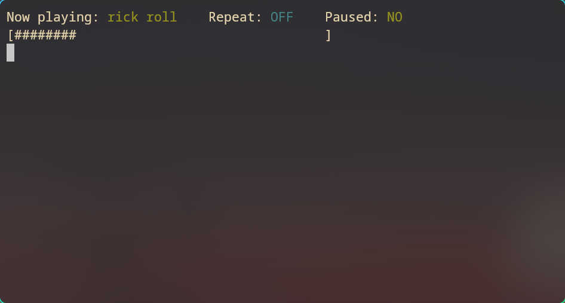

# Termify

**Termify** is a terminal-based YouTube audio player written in modern C++, featuring a real-time waveform visualizer. It allows you to search and stream audio from YouTube with a minimal, responsive interface powered by FFmpeg and ALSA.  

---

## Features

- Play audio from YouTube directly from your terminal
- Search support via `yt-dlp`
- Real-time waveform visualization using terminal bars
- Asynchronous decoding and playback
- Ring buffer for smooth streaming
- Fully written in modern C++ with no external GUI dependencies

---

## Planned Features

- Song queueing and repeat modes
- Skip 
- Volume control
- Intelligent caching
- Playlist support
- Multiplatform support (only Linux for now)
- Graceful shutdown and error handling

---

## Dependencies

- [FFmpeg](https://ffmpeg.org)
- [ALSA](https://alsa-project.org)

---

## Building from Source

### Requirements

- **FOR NOW IT ONLY WORK FOR LINUX**
- A C++23-compatible compiler (e.g. `g++ 11+` or `clang++ 13+`)
- CMake 3.16+
- FFmpeg dev libraries (`libavformat`, `libavcodec`, etc.)
- ALSA dev libraries (`libasound2-dev`)
- `yt-dlp` (either in `PATH` or placed in project root or bin folder)

### Build Instructions

```bash
git clone https://github.com/alexbsec/termify.git
cd termify
chmod +x ./scripts/build.sh
make build
make run
```

During development, `yt-dlp` should be located in `./bin/.local/bin/yt-dlp`.  
In release, it's expected at `/usr/local/share/termify/bin/yt-dlp`.


## Installing 

To install the latest version, run:

```bash
git clone https://github.com/alexbsec/termify.git
cd termify
chmod +x ./scripts/release.sh
make install
```

Now `termify` should be available as a global command, as long as `/usr/local/bin` is in your environment variables. To make sure, run

```bash
export PATH="/usr/local/bin:$PATH"
```

---11

## License

MIT — feel free to use and modify.

---

## Author

Made with caffeine and bitshifting by [@alexbsec](https://github.com/alexbsec)
